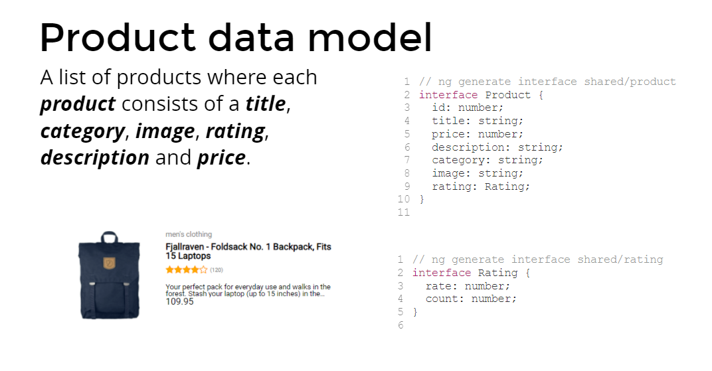
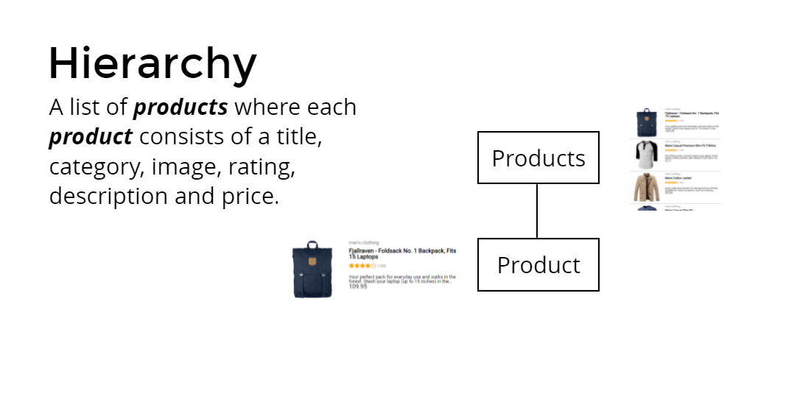
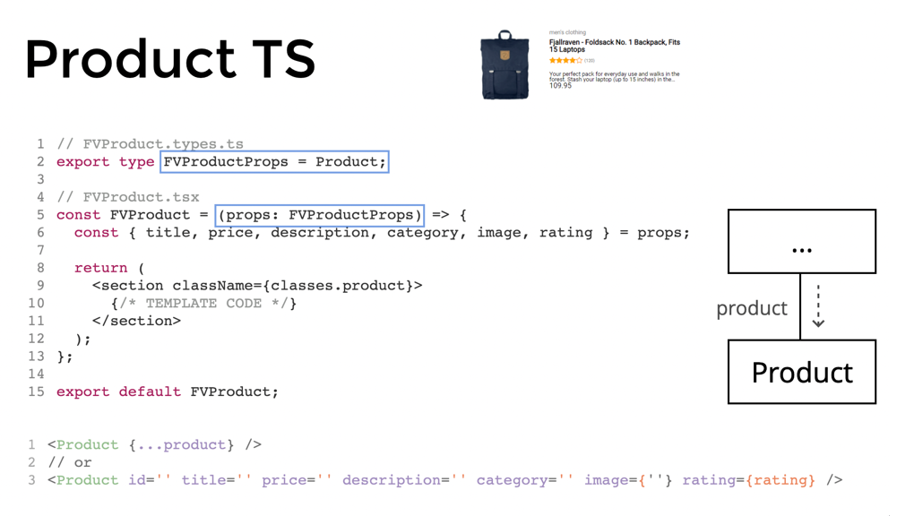
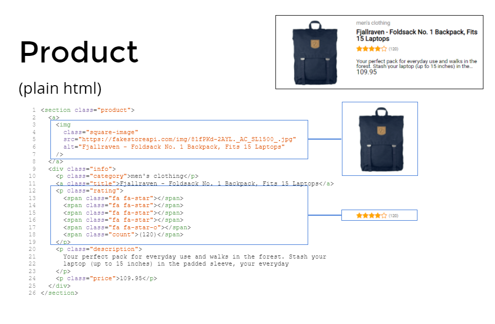

# Assignment 1 Components

## 1.1 Setting up a data model



- Create a product interface
- Create a rating interface

Place them into the `./src/types/` folder, it will make the project more structured and scalable

## 1.2 Setting up components



Create components `FVProductsList` and `FVProduct` in the folder `components`.Make separate files for style, test, types and detail.
You can do it manually or you can use [generate-react-cli](https://github.com/arminbro/generate-react-cli)

In `App.tsx` import the component <FVProductsList />

- Configure the `FVProduct` component so it accepts a `props` of type `Product`.

- Add the following product to `components/FVProductsList/FVProductsList.tsx` and make sure it's typed correctly

```typescript
const product = {
  id: 1,
  title: 'Fjallraven - Foldsack No. 1 Backpack, Fits 15 Laptops',
  price: 109.95,
  description:
    'Your perfect pack for everyday use and walks in the forest. Stash your laptop (up to 15 inches) in the padded sleeve, your every day',
  category: "men's clothing",
  image: 'https://fakestoreapi.com/img/81fPKd-2AYL._AC_SL1500_.jpg',
  rating: {
    rate: 3.9,
    count: 120
  }
};
```

\_To quickly see the value of `product` on-screen use a `JSON.stringify` in `FVProductsList.tsx`:

```tsx
return <>{JSON.stringify(product)}</>;
```



- Paste the following HTML in `FVProduct.tsx`:

```html
<section class="product">
       
  <a>
               
    
           
  </a>
       
  <div class="info">
               
    <p class="category">men's clothing</p>
            <a class="title">Fjallraven - Foldsack No. 1 Backpack, Fits 15 Laptops</a>        
    <p class="rating">
                  <span class="fa fa-star star"></span>      
      <span class="fa fa-star star"></span>             <span class="fa fa-star star"></span>      
      <span class="fa fa-star star"></span>             <span class="fa fa-star-o star"></span>    
        <span class="count">(120)</span>        
    </p>
               
    <p class="description">
                  Your perfect pack for everyday use and walks in the forest. Stash your laptop (up
      to 15             inches) in the padded sleeve, your everyday        
    </p>
               
    <p class="price">109.95</p>
           
  </div>
</section>
```

Before we fix the template, we should render the `FVProduct` component and make sure it receives a product.

- Update the `FVProductsList` component so it uses an `FVProduct` component to render the product.

- Update the `FVProduct` component so there are no hardcoded values (except for the rating).

Resources:

- [Components and Props](https://reactjs.org/docs/components-and-props.html)

You should have a working page with one product on the screen.

## 1.3 More Components



- Create a component for `FVRating` and `FVSquareImage`

- Move the hardcoded rating HTML to the `FVRating` component and use it in the `FVProduct` Component.
- For star icons, you can use [Fontawesome for React](https://fontawesome.com/v5/docs/web/use-with/react). Take a look at the following code:

```tsx
import { FontAwesomeIcon } from '@fortawesome/react-fontawesome';
import { faStar, faStarHalfStroke } from '@fortawesome/free-solid-svg-icons';
import { faStar as faStarEmpty } from '@fortawesome/free-regular-svg-icons';

// usage ...
(<FontAwesomeIcon icon={faStarEmpty} />),
  (<FontAwesomeIcon icon={faStarHalfStroke} />),
  (<FontAwesomeIcon icon={faStar} />);
```

- Move the square image HTML to the `FVSquareImage` component, make sure it supports `[src]` + `[alt]` inputs and use it in the `FVProduct` component.

## 1.4 List of products


- Refactor `FVProductsList` components so it excepts props `Product[]`, move the `product` object into the `App` component and pass it down to the `FVProductsList` component.
- Refactor the `product` object into an array of type 'Product', and add the following product to the array so you have 2 products in total.

```typescript
{
  id: 2,
  title: 'Mens Casual Premium Slim Fit T-Shirts ',
  price: 22.3,
  description:
    'Slim-fitting style, contrast raglan long sleeve, three-button henley placket, light weight & soft fabric for breathable and comfortable wearing. And Solid stitched shirts with round neck are made for durability and a great fit for casual fashion wear and diehard baseball fans. The Henley style round neckline includes a three-button placket.',
  category: "men's clothing",
  image:
    'https://fakestoreapi.com/img/71-3HjGNDUL._AC_SY879._SX._UX._SY._UY_.jpg',
  rating: {
    rate: 4.1,
    count: 259,
  },
},
```

- Render a list of products by using the `map` function in combination with the `FVProduct` component, take a look at the following example:

```tsx
<ul>
  {products.map((product) => (
    <li key={product.id}>
      <FVProduct {...product} />
    </li>
  ))}
</ul>
```

Resources:

- [Lists and Keys](https://reactjs.org/docs/lists-and-keys.html)

You should see 2 different products on the screen.

## 1.5 Styling

- Currently, all styling is globally registered in src/index.scss.

- Move all component-specific CSS to the styles of the components.

There are multiple options for working with styles in react, take a look at some at [Adding a Stylesheet](https://create-react-app.dev/docs/adding-a-stylesheet). For this course, we are using SCSS modules.

More Resources:

- [Styling and CSS](https://reactjs.org/docs/faq-styling.html)

Your app should still render correctly.

[Solution](https://github.com/FrontValue/react-training/compare/master...assignment-2)
